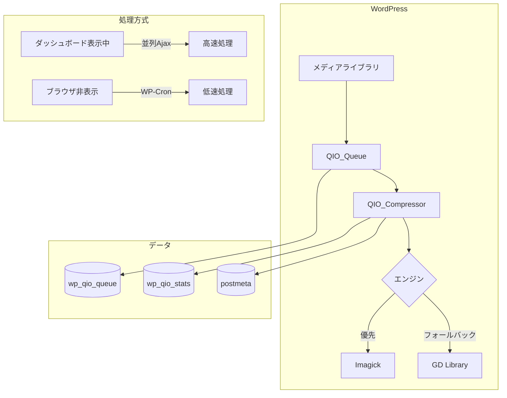
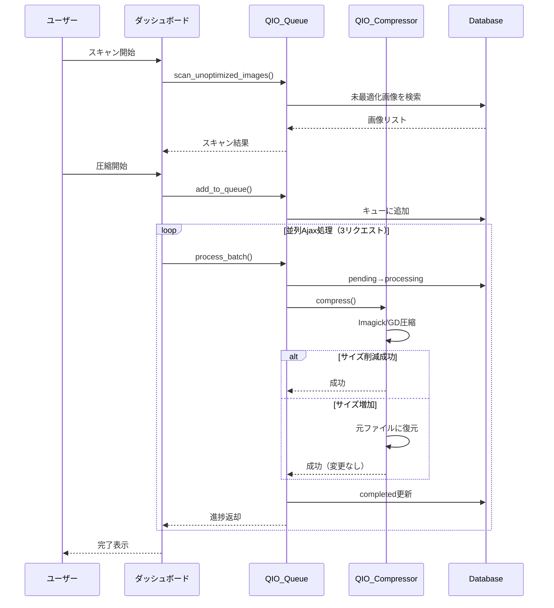
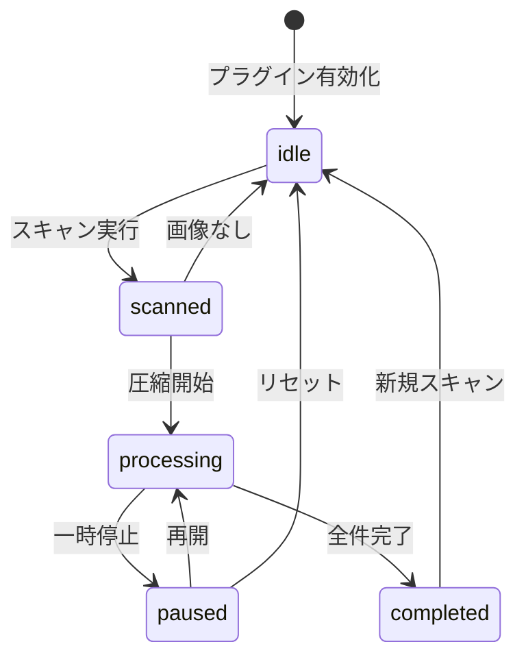

# Queue Image Optimizer

[](https://github.com/t-hirai03/Queue-Image-Optimizer/actions/workflows/php-compatibility.yml)
[](https://github.com/t-hirai03/Queue-Image-Optimizer/actions/workflows/plugin-check.yml)
[](https://github.com/t-hirai03/Queue-Image-Optimizer/actions/workflows/security.yml)

大量の画像を安全に最適化できるWordPressプラグイン。非同期キュー処理により、サーバー負荷を分散し、バックグラウンドで画像圧縮を実行します。

## 特徴

- **外部APIなし** - ローカルで完結（Imagick/GD使用）
- **高速処理** - ダッシュボード表示中は並列Ajax処理
- **バックグラウンド継続** - ブラウザを閉じてもWP-Cronで処理継続
- **サイズ増加防止** - 圧縮でサイズが増える場合は自動で元に戻す

## アーキテクチャ



## 処理フロー



## 状態遷移



## 動作要件

| 要件 | バージョン |
|------|-----------|
| WordPress | 5.0+ |
| PHP | 8.0+ |
| 画像エンジン | Imagick（推奨）または GD |

## インストール

### 方法1: ZIPアップロード

1. [Releases](https://github.com/t-hirai03/Queue-Image-Optimizer/releases)からZIPをダウンロード
2. WordPress管理画面 > プラグイン > 新規追加 > アップロード
3. 有効化

### 方法2: Git Clone

```bash
cd wp-content/plugins
git clone https://github.com/t-hirai03/Queue-Image-Optimizer.git queue-image-optimizer
```

## 使い方

1. 管理画面 > **Queue Image Optimizer** にアクセス
2. 「**スキャン開始**」で未最適化画像を検出
3. 「**圧縮を開始**」でバックグラウンド処理開始
4. ページを開いたままにすると高速処理

## 処理モード

| モード | 間隔 | バッチサイズ | 推奨環境 |
|--------|------|------------|----------|
| 安全 | 5分 | 10枚 | 共有ホスティング |
| 標準 | 1分 | 20枚 | VPS |
| 高速 | 連続 | 300枚 | 専用サーバー |
| カスタム | 任意 | 任意 | 上級者向け |

## 圧縮品質

| 形式 | 範囲 | 推奨値 | 説明 |
|------|------|--------|------|
| JPEG | 1-100 | 75-85 | 値が小さいほど高圧縮 |
| PNG | 0-9 | 6-8 | 値が大きいほど高圧縮 |

## フック

### アクション

```php
// 全処理完了時
add_action( 'qio_completed', function( $progress ) {
    // 通知送信など
});
```

### フィルター

```php
// JPEG品質を変更
add_filter( 'qio_jpeg_quality', function( $quality ) {
    return 80;
});

// 特定画像をスキップ
add_filter( 'qio_skip_image', function( $skip, $attachment_id ) {
    if ( get_post_meta( $attachment_id, '_skip_optimization', true ) ) {
        return true;
    }
    return $skip;
}, 10, 2 );
```

## CI/CD

| ワークフロー | 内容 |
|-------------|------|
| PHP Compatibility | PHP 8.0-8.4 構文チェック |
| WordPress Plugin Check | WP公式審査ツール |
| PHPStan | 静的解析 |
| Security Scan | 脆弱性チェック |
| ESLint | JSコードスタイル |
| PHPUnit | 単体テスト |
| Release | 自動リリース作成 |

## ライセンス

GPL v2 or later
